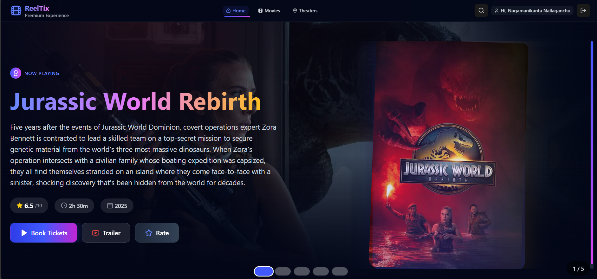
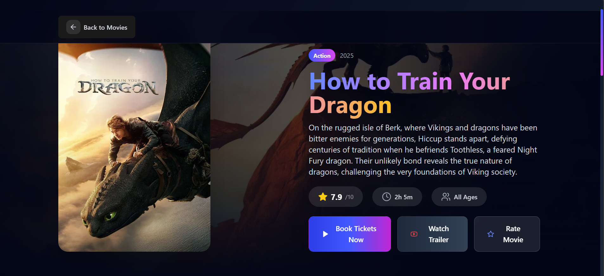
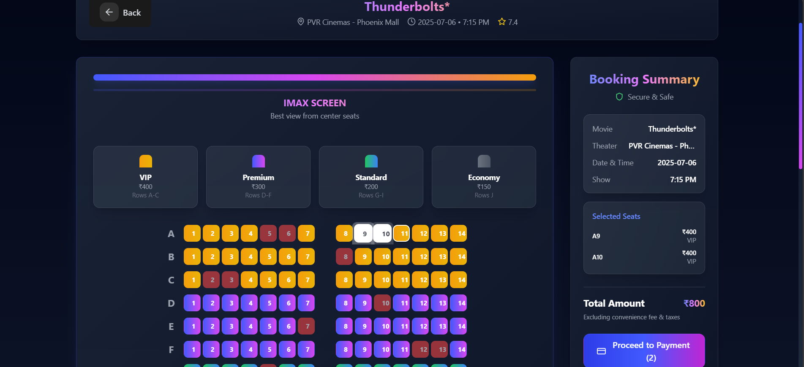
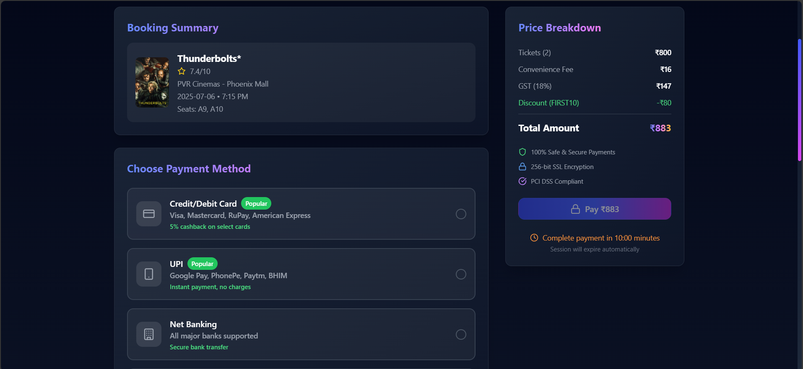

# 🎬 Reeltix - AI-Powered Movie Ticket Booking Website

**Reeltix** is a fully functional movie ticket booking web application developed without writing a single line of code — entirely using **AI models** and **prompt engineering skills**. This project showcases how artificial intelligence can be used to build real-world applications efficiently.

It uses data from **[TheMovieDB API](https://www.themoviedb.org/documentation/api)** to fetch movie listings, details, trailers, and more.

---

## 🚀 Features

- 🔍 **Browse Movies** - View trending, upcoming, and now-playing movies.
- 🎫 **Book Tickets** - Select seats, showtime, and confirm your booking.
- 💳 **Payment Integration** - Simulated payment gateway for booking confirmation.
- 🧠 **AI-Driven Build** - Created entirely using prompt engineering, no traditional coding.
- 📍 **Theater & Seat Selection** - Interactive seat maps and theater listings.
- 🌐 **Streaming Availability** - See where a movie is streaming online.
- ⭐ **User Ratings & Reviews** - View and add ratings using a modal.
- 🔐 **Login / Sign Up** - Authentication for users.
- 🧾 **Booking Confirmation** - Instant confirmation after payment.
- 📱 **Responsive Design** - Optimized for desktop and mobile using Tailwind CSS.

---

## 🧠 Built With AI

This project was created using **zero manual coding**. Instead, it was built using:
- 💬 Prompt engineering to generate code
- 🤖 AI coding models to structure and generate entire React + Node.js applications
- 🧠 Smart integration of APIs, UI logic, and component design

---

## 🖼️ Screenshots

### 🎬 Home Page


### 📄 Movie Details


### 🪑 Seat Selection


### 💳 Payment Modal


---

## 🔗 Live Demo

**🌐 [Live Project on Vercel](https://reeltix.vercel.app/)**  
_Deployed with Vercel for global accessibility and blazing-fast performance._

---

## ⚙️ Tech Stack

- **Frontend:** React.js + Tailwind CSS + Vite
- **Backend:** Node.js + Express.js
- **API:** [TheMovieDB API](https://www.themoviedb.org/)
- **Deployment:** Vercel
- **State Management:** React hooks
- **Other Tools:** PostCSS, ESLint

---

## 📂 Folder Structure

project/
├── server/ # Node.js backend server
│ ├── index.js
│ └── package.json
├── src/ # Frontend source files
│ ├── assets/ # Static assets
│ ├── components/ # Reusable UI components
│ ├── pages/ # Main route pages (Home, Login, MovieDetails, etc.)
│ ├── services/ # API and business logic
│ ├── App.jsx
│ ├── main.jsx
│ └── index.css
├── .env # Environment variables (API keys etc.)
├── README.md # You are here!
└── vite.config.js # Vite configuration


---

## 🔐 Environment Variables

To run this project locally, create a `.env` file in the root and add your API key:

```env
VITE_TMDB_API_KEY=your_tmdb_api_key_here

## 🛠️ Setup Instructions

```bash
# Clone the repository
git clone https://github.com/your-username/reeltix.git

# Navigate to the project
cd reeltix

# Install dependencies
npm install

# Run the development server
npm run dev
```
---

## ✨ Credits

- 🎬 TheMovieDB API — for providing movie data  
- ▲   Vercel — for fast and easy deployment  
- ⚡ Bolt AI — used to generate this project entirely through prompt engineering
